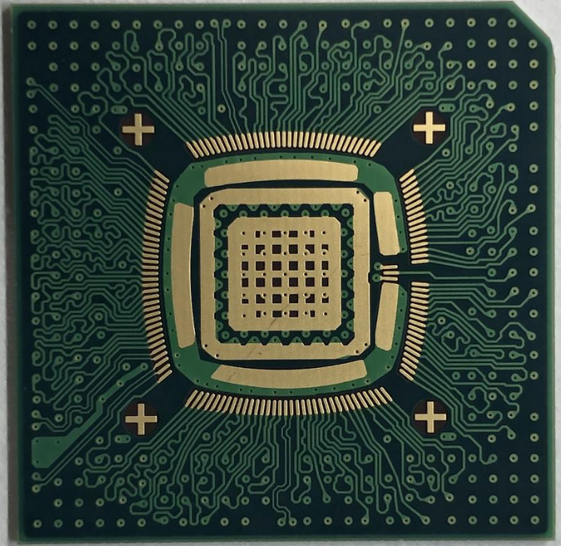

This is the subdirectory for the 355-ball UW wirebond BGA package, which supports 3x3 die and smaller. It provides 135 signal pins, out of a total of 269 bond pads (the rest are used for high-quality VDD,I/O VDD and VSS). The package has 4 layers; the inner two layers are power and ground planes. This particular package has been optimized for a 32-bit DDR interface, and 2 full duplex 8-bit channels. The I/O is aggressively designed and supports LVCMOS speeds of 400-500 megabits+ per pin in a well-designed system. Traces within signal groups are length matched.

**pcb**:  What you need to physically make the package and use it. Design collatoral to send to substrate fab and assembly
          files for modelling the package, clarifications, or modifying the substrate.

**pinouts**: This is what most chip designers will spend most of their time looking at.

Quick links:

   [Verilog interface to the package](https://github.com/bespoke-silicon-group/bsg_packaging/blob/master/uw_bga/pinouts/bsg_asic_cloud/common/verilog/bsg_pinout.v)
      
   [Picture of the package](https://github.com/bespoke-silicon-group/bsg_packaging/blob/master/uw_bga/UW_BGA.png)

   
   
   
